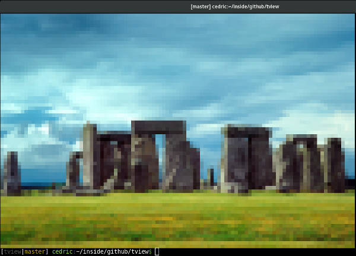
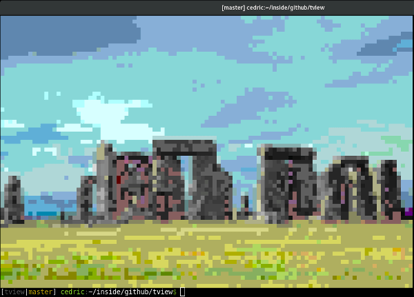

# T-View: Open images inside the terminal!

T-View is an image viewer, that can load local files as well as web URL.

It is proudly powered by [Terminal-kit](https://www.npmjs.com/package/terminal-kit).

First, install it globally (recommended): `npm install -g tview`.

Then, usage is: `tview <file-path | web URL> [url2] [...] [option1] [option2] [...]`

Options:

* --move , -m : interactively move the image around
* --scale , -s : scale relative to the terminal size (e.g.: *1* fits the terminal)
* --help , -h : display the help

Examples:

* `tview some-image.jpg`
* `tview some-image.jpg another-image.jpg`
* `tview https://upload.wikimedia.org/wikipedia/commons/1/1e/Stonehenge.jpg`
* `tview -m https://upload.wikimedia.org/wikipedia/commons/1/1e/Stonehenge.jpg`
* `tview -m -s 3 https://upload.wikimedia.org/wikipedia/commons/1/1e/Stonehenge.jpg`

If your terminal supports true colors, this would produce something like this:

If your terminal doesn't support true colors, **the closest color in the available palette** is used.
Example with a 256 colors terminal:

